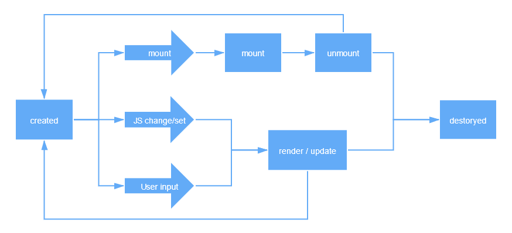

# 第十四周

## 组件化基础

**目的**：提升代码复用率，降低工作、工程难度。

### 对象与组件

#### 对象

**三大要素**

1. properties：属性
2. methods：方法
3. inherit：继承关系，js中使用原型继承

#### 组件

**组件化**区别于模块化、区别于对象；组件一般认为与UI强相关；它既可定义为对象也可定义为模块，某种意义上认为他是特殊的模块/特殊的对象；

**特点**：可以以树形结构来组合，有一定的模板化配置能力。

**要素**：

1. properties：属性
2. methods：方法
3. inherit：继承关系，js中使用原型继承
4. attributter：特性
5. config&state：config是对组件的配置，构造函数时传入的参数；state状态，随操作变化
6. event：组件向外传递的东西
7. lifecycle：生命周期
8. children：树形结构形成的必要条件。如果无法形成树形结构，那么描述界面的能力会比较差。

对比对象新增的“语义”的部分，都提高了组件描述界面的能力。

##### Attribute与Property

- Attribute：强调描述性，来源于XML中attribute的概念。
- Property：强调从属关系，通常使用面向对象的概念。

例：HTML

HTML是典型的Attribute与Property不等效的系统。

**Attribute**可用HTML或者JS设置，HTML中的Markup为最常用：

- Markup set：

  ```html
  <div attribute="value"/>
  ```

- JS set

  ```javascript
  a.getAttribute("attrName")
  ```

**Property**使用JS设置：

```javascript
compontent.prop="value"
```

**差异：**

1. class与className的历史问题：

2. Attribute是字符串Property是字符串语义化之后的对象

3. href属性

4. value：Attribute是默认值

   示例：`<imput value="cute"/>`

   ```javascript
   var input =document.getElementByTagName("input");
   //若value未设置，则结果是Attribute
   input.value;//cute
   input.getAttribute('value');//cute
   
   input.value='hello';
   //若value属性已设置，则Attribute不变，Property变化，元素实际以Property优先
   input.value;//hello
   input.getAttribute('value');//cute
   ```

   

##### 组件各要素区别

|             | Markup set（标签设置） | JS set | JS change | User input change |
| :---------: | :--------------------: | :----: | :-------: | :---------------: |
|  property   |           x            |   √    |     √     |         ?         |
| attributter |           √            |   √    |     √     |         ?         |
|    state    |           x            |   x    |     x     |         √         |
|   config    |           x            |   √    |     x     |         x         |

1. property：大部分时候property不应受用户输入的直接控制。
2. state：仅能从组件内部改变。若其他人可以从组件外部改写组件，那组件的state将非常容易失控，一致性无法保证。
3. config：在构造时一次性传入，不可更改，一般把config留给全局。

##### 生命周期



##### children

children分为content型children和template型children

- content型：有几个显示几个
- template型：可能有list的结构，例如：
  - react：无template，但children传函数return出来，是一种template的用法
  - vue：列表中的patch

## JSX组件

### JSX语法简介

JSX相当于代码纯粹在语法上的快捷方式，把html转化为createElement的JS函数，用法类似于语法糖。

### JSX环境搭建

Babel是webpack中的插件，JSX依赖于Babel中的一个插件实现。

故搭建JSX运行环境需要依次安装：

1. webpack：将不同的js中import、required的部分打包到一块，同时也有将其他资源文件压缩等功能

   `npm install -g webpack webpack-cli`

2. babel-loader：

   `npm install --save-dev webpack babel-loader`

3. babel：将新版js中稳定浏览器未实现的部分编译成浏览器识别的js版本的代码；

   babel-loader没有依赖好babel，故需要安装@babel/core @babel/preset-env；

   `npm install --save-dev @babel/core @babel/preset-env`

4. babel-plugin：

   `npm install --save-dev @babel/plugin-transform-react-jsx`

   在该包的转化下，js中的标签会变为React.createElement()的调用

**webpack.config.js**的配置为：

```javascript
module.exports = {
    entry: './main.js',
    module: {
        rules: [
            {
                test:/\.js$/,
                use: {
                    loader: 'babel-loader',
                    options: {
                        presets: ['@babel/preset-env'],
                        plugins: [['@babel/plugin-transform-react-jsx', {pragma:'createElement'}]]
                    }
                }
            }
        ]
    },
    mode: 'development'
}
```

说明：

**plugins**项中的参数以[]分割每个plugin，数组项的具体结构总结为：`['插件名'，{配置的对象}]`

`{配置的对象}`中更改transform的名字的方式为设置`{pragma:"XXX"}`，这会使XXX代替默认的React.createElement()，如此JSX便与React毫无关系了。

完整的XXX（原React.createElement()）写作

```javascript
XXX("type"，{attrs}，…children)
```

三个参数为：

1. 元素类型
2. 属性列表
3. 不定参，子元素列表
